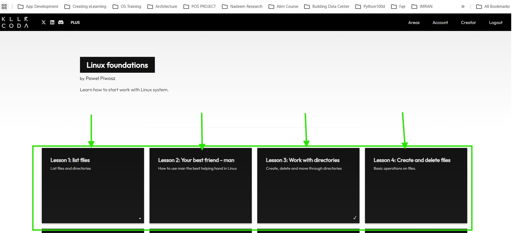
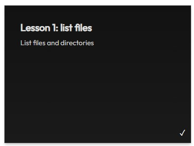
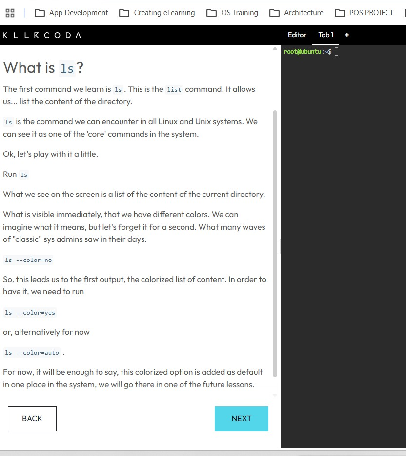
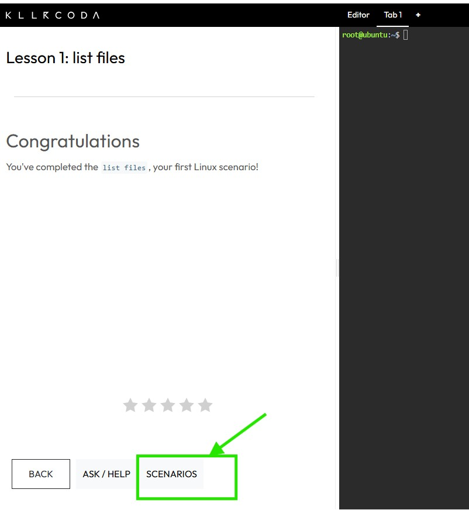
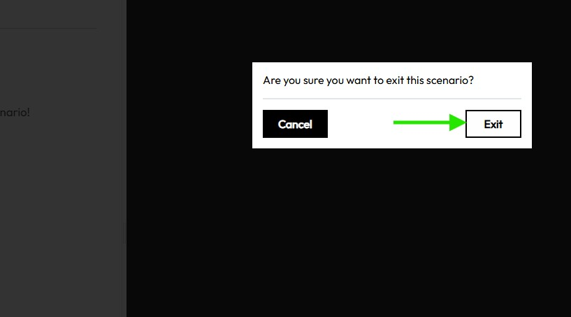
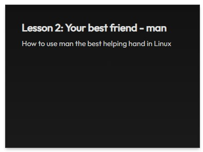
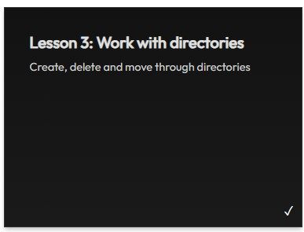

# Practice Lab - Day 12
> 20th May, 2026
This Practice lab is designed to give you hands-on understanding using www.killercoda.com as a learning tool

### Task 1: Click on the Landing Page and Select the Linux Module

### Task 2: Select the "Linux" Module
Select the module:
> Pawel Piwosz is devoted to Serverless and CI/CD. He is DevOps Institute Ambassador, CD.Foundation Ambassador, AWS Community Builder, Engineer, Leader, Mentor, Speaker.

 

### NOTE: There are a total of four (4) Lessons that you must complete in Killercoda

### Task 4: Lesson1 - List Files
Select the module below:

###You will see the following. Use the Linux Box Provided and follow all the steps.

When you are done/finished Click on the blue button "NEXT":

DO NOT EXIT. If you want to come back later and start all over. Click "NEXT" until you reach this final screen an click on "Scenario"

You will be given the option to "Exit" so click on it. If you want to come back and start all over do so. If you are done Congratulations!

## Please complete all the other modules as explained above:

### Task 2: Lesson 2 - Your best friend "man"

### Task 3: Lesson 3 - Create and Delete Files

### Task 4: Lesson 4 - Create and Delete Files

# Final Submission:
Post on your LinkedIn account your 12th Day at Working in Nexus (NIT). Have you enjoyed working with Linux Commands?